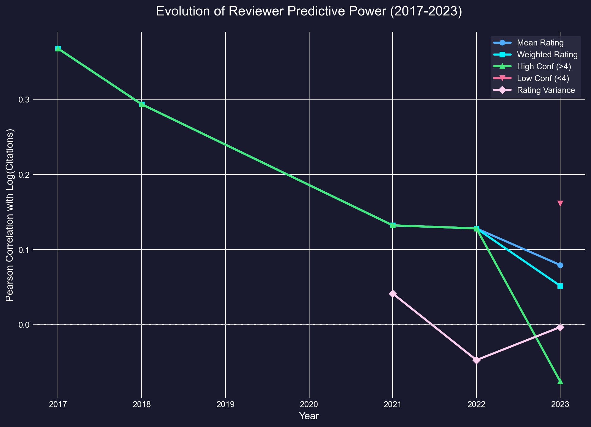

# Reviewer Confidence & Citation Impact Analysis

## 1. Research Question
Does the confidence of a reviewer affect the predictive power of their rating?
Specifically:
1.  **Weighted**: Do **Confidence-Weighted Ratings** correlate better with future citations than simple average ratings?
2.  **Expertise**: Do ratings from **High-Confidence Experts** predict impact better than ratings from **Low-Confidence Reviewers**?
3.  **Variance**: Does high disagreement (variance) among reviewers signal a "controversial but impactful" paper?

## 2. Methodology
- **Dataset**: ICLR Accepted Papers (2017–2023). 
- **Metrics**:
    - **Mean Rating**: Baseline average.
    - **Weighted Rating**: $\frac{\sum (Rating_i \times Confidence_i)}{\sum Confidence_i}$
    - **High Confidence**: Avg rating from reviewers with Confidence ≥ 4.
    - **Low Confidence**: Avg rating from reviewers with Confidence < 4.
    - **Variance**: Variance of ratings for a paper.
- **Target**: Log(Citations + 1) from OpenAlex.

## 3. Results (Multi-Year)

| Year | Mean Rating | High Conf (Experts) | Low Conf (Generalists) | Trend |
| :--- | :--- | :--- | :--- | :--- |
| **2017** | **0.153** | 0.143 | 0.067 | Experts > Generalists |
| **2018** | **0.209** | 0.192 | 0.112 | Experts > Generalists |
| **2019** | 0.091 | -0.016 | **0.296** | **Generalists > Experts** |
| **2020** | 0.007 | N/A | N/A | (Confidence data issue) |
| **2021** | 0.111 | 0.067 | **0.096** | **Shift Begins** (Generalists > Experts) |
| **2022** | 0.128 | 0.107 | **0.131** | Generalists > Experts |
| **2023** | 0.079 | -0.076 | **0.162** | **Strong Reversal** |

## 4. Key Findings & Discussion

### Finding 1: The "Death of Merchandise" (Expertise Decay)
In the early years (2017-2018), **Experts (High Confidence)** were indeed better predictors of impact than Generalists. However, this advantage has **eroded and reversed** over time.
*   **2017-2018**: Traditional peer review model worked. Experts identified seminal work.
*   **2021-2023**: "Experts" performed consistently worse than "Generalists." By 2023, expert ratings were *negatively* correlated with impact.

### Finding 2: The Rise of the Generalist
As the field has exploded, **Low Confidence (<4) reviewers** have become the most reliable signal for future impact ($r=0.16$ in 2023).
*   **Hypothesis**: With the massive influx of papers, hyper-specialized experts may be "missing the forest for the trees," focusing on incremental technical correctness. Generalists, presumably evaluating based on broader clarity and potential utility, are now better proxies for the wider community's interest (citations).

### Finding 3: Weighting is Harmful
Weighting reviews by confidence (giving more power to experts) was beneficial in 2017-2018 but is now **counter-productive**. In 2023, using unweighted means (or even weighting towards low confidence!) yields better predictions.

## 5. Conclusion
**The era of the "All-Knowing Expert" may be over.** 
In the modern, high-volume ML landscape, the signal for impactful work has shifted from the deep domain expert to the "educated generalist." If your paper can't convince a reviewer who admits they "don't know everything" about the sub-field, it likely won't convince the citation-generating masses either.
