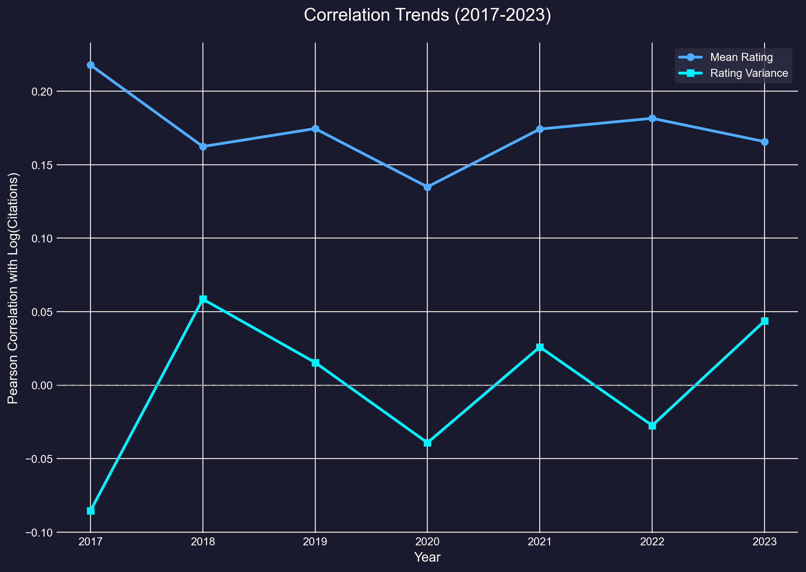
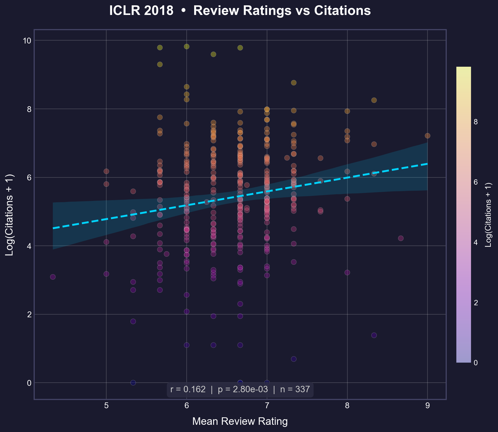
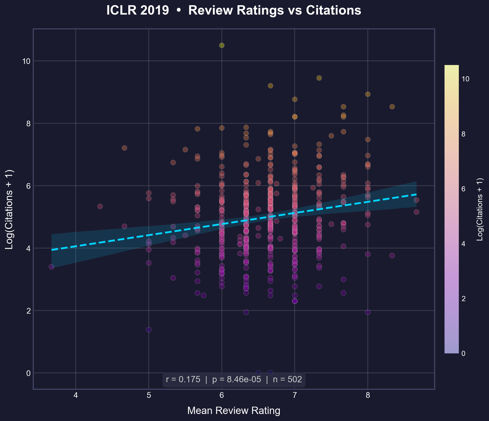
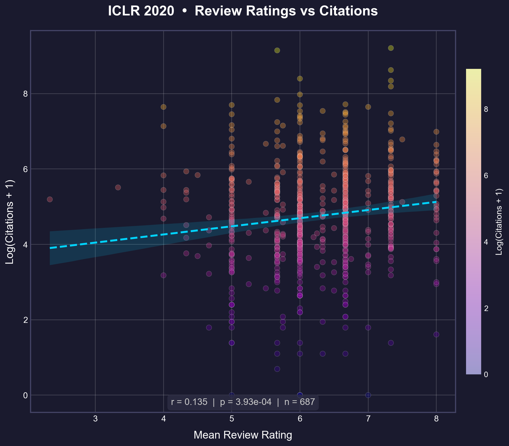
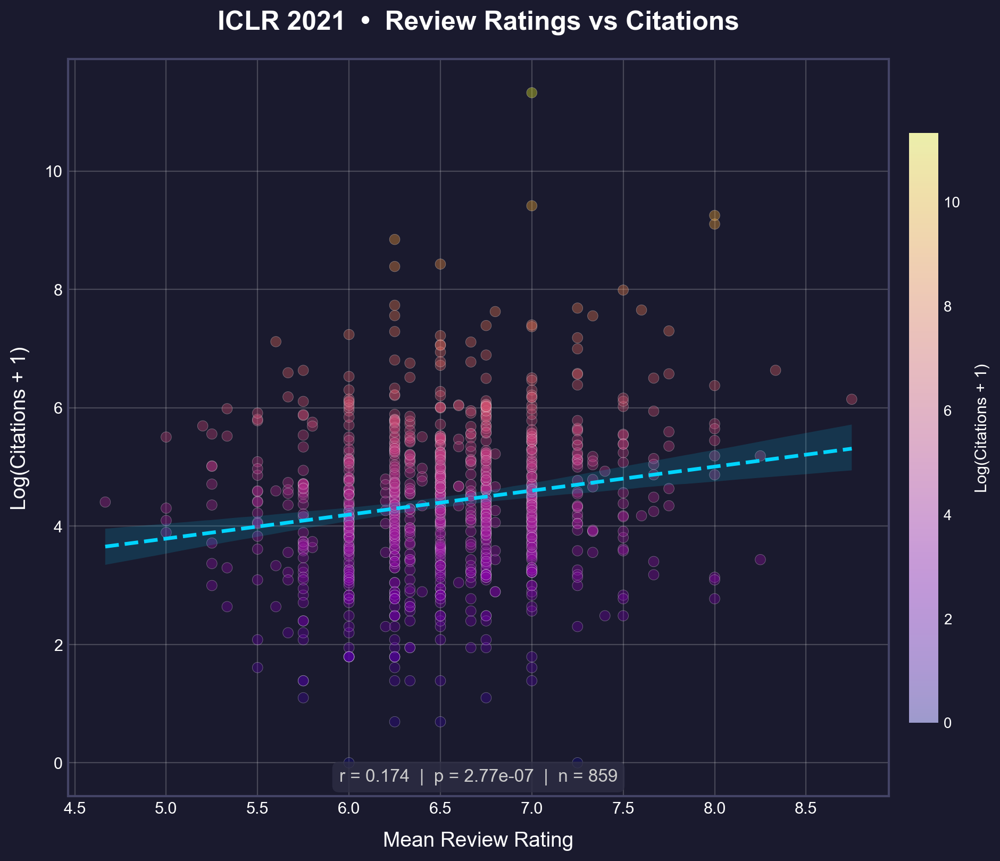
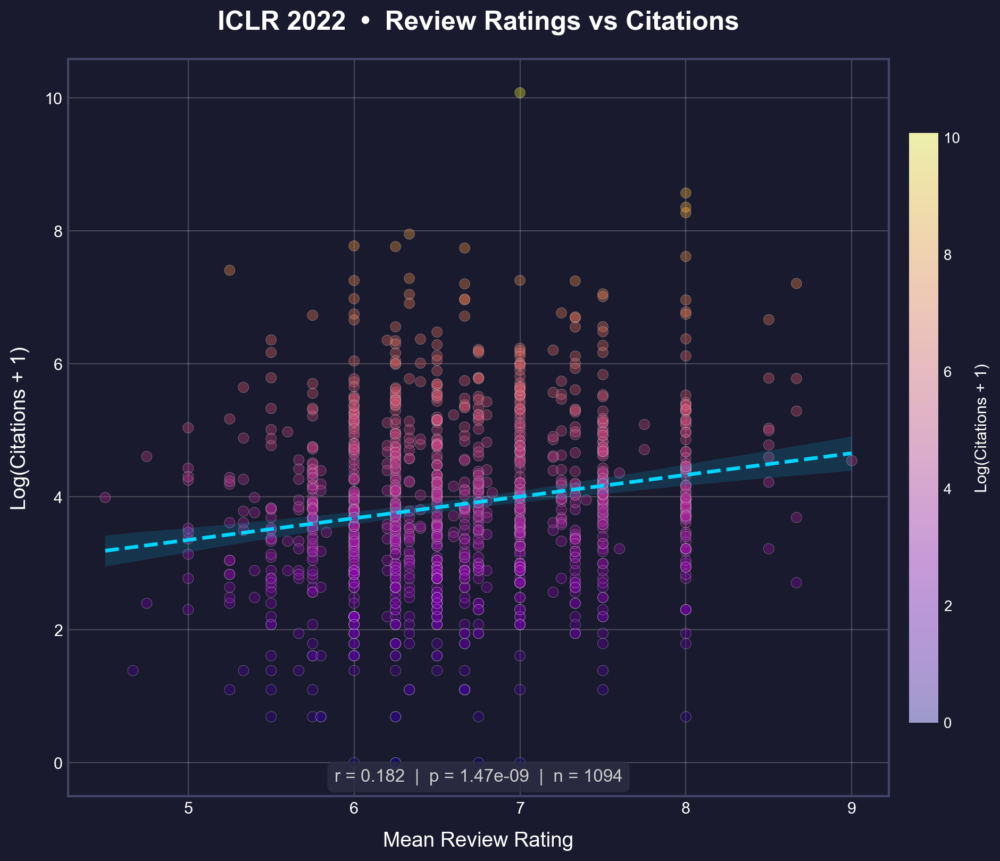
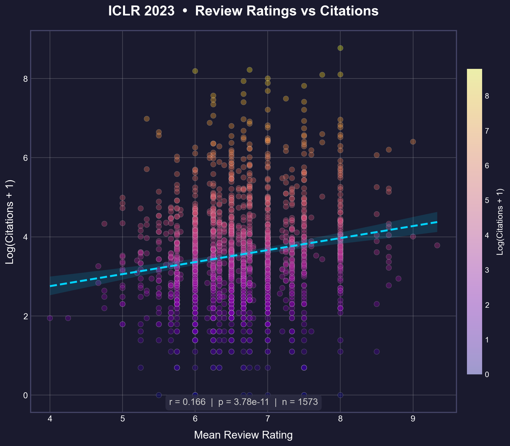

# Impact Correlation: Review Ratings vs Citations
**ICLR 2017–2023**

## Overview
This analysis measures the Pearson correlation between mean review ratings and log-transformed citation counts (`log(citations + 1)`) for accepted ICLR papers across seven years.

> **Note**: "Invite to Workshop Track" papers (present in ICLR 2017–2018) are **excluded** from this analysis. Analysis 8 demonstrated that these papers are statistically distinct from Poster-tier papers (significantly lower ratings and citations), and including them artificially inflated the early-year correlations.

---

## Results

### Correlation Table (Pearson r)

| Year | Pearson (r) | n | p-value |
|------|-------------|---|---------|
| 2017 | 0.218 | 198 | 0.002 |
| 2018 | 0.162 | 337 | 0.003 |
| 2019 | 0.175 | 502 | < 0.001 |
| 2020 | 0.135 | 687 | < 0.001 |
| 2021 | 0.174 | 859 | < 0.001 |
| 2022 | 0.182 | 1094 | < 0.001 |
| 2023 | 0.166 | 1573 | < 0.001 |

### Trend Plot

### Scatter Plots (Individual Years)

<table>
  <tr>
    <td></td>
    <td></td>
  </tr>
  <tr>
    <td></td>
    <td></td>
  </tr>
  <tr>
    <td></td>
    <td></td>
  </tr>
  <tr>
    <td></td>
  </tr>
</table>

---

## Interpretation

The correlation between review ratings and citations shows a **modest positive relationship** across all years, with all correlations statistically significant (p < 0.01).

### Key Findings

1. **No inflated early-year signal**: After excluding Workshop Track papers, the 2017–2018 correlations (r ≈ 0.16–0.22) are much closer to the 2019+ baseline (r ≈ 0.13–0.18) than previously reported (r ≈ 0.32–0.38). The previously observed "dramatic decline" was largely an artifact of Workshop Track contamination.

2. **Stable baseline**: The correlation has been relatively stable at r ≈ 0.17 across all years, suggesting that review ratings have maintained a consistent (but modest) predictive power for citation impact.

3. **Why the previous numbers were inflated**: Workshop papers had both lower ratings (~5.4) and fewer citations (median ~62–73), creating an artificial "floor" that strengthened the observed correlation. Removing this subgroup reveals the true relationship among genuine acceptance-tier papers.

## Methodology
- **Metric**: Pearson correlation between `mean_rating` and `log(citations + 1)`
- **Data**: Google Scholar citations (higher coverage than OpenAlex)
- **Exclusion**: "Invite to Workshop Track" papers (47 in 2017, 90 in 2018)
