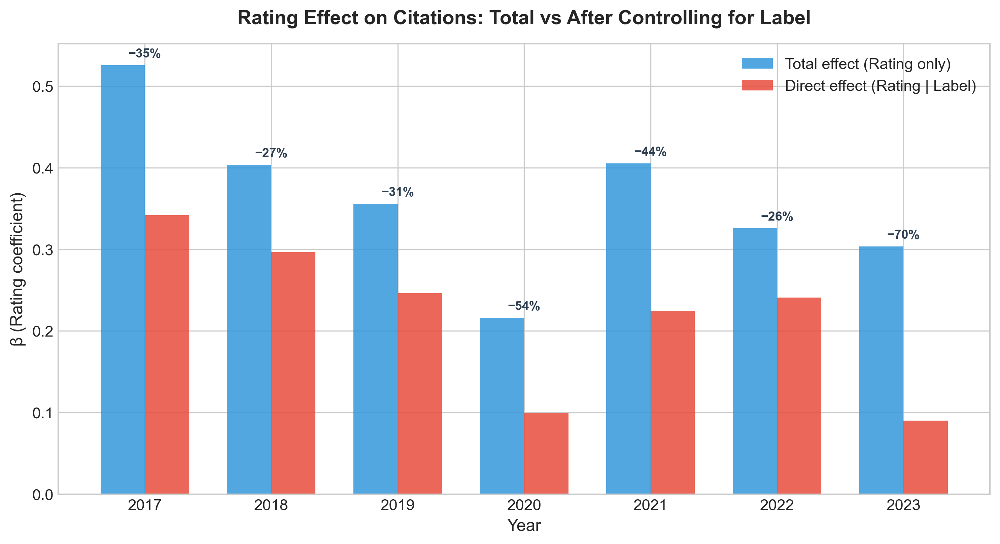
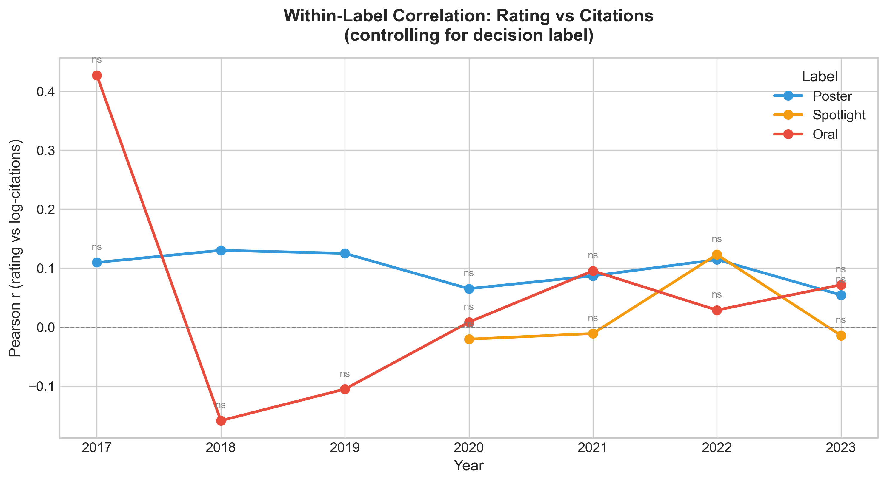

# Hypothesis Test: Is the Decision Label the Sole Mediator of the Rating–Citation Correlation?

## Hypothesis
The positive correlation (r ≈ 0.13–0.22) between review ratings and citation counts may not reflect a direct effect of ratings on citations. Instead, **higher ratings → higher-prestige labels (Oral/Spotlight) → more citations** may be the operative pathway.

---

## Methodology

### 1. Hierarchical Regression
- **Model A** (Total Effect): `log_citations ~ mean_rating`
- **Model B** (Direct Effect): `log_citations ~ mean_rating + C(label)`
- **Attenuation %** = how much the rating coefficient shrinks when label is added

### 2. Within-Label Partial Correlation
- Compute `r(mean_rating, log_citations)` separately for Poster-only, Spotlight-only, and Oral-only subsets
- "Invite to Workshop Track" papers (2017–2018) are classified as Poster
- Under complete mediation, within-label correlations should be ≈ 0

---

## Results

### Hierarchical Regression

| Year | N    | r(overall) | β_total | sig | β_direct | sig | Attenuation |
|------|------|-----------|---------|-----|----------|-----|-------------|
| 2017 | 198  | 0.218     | 0.5257  | **  | 0.3418   | ns  | 35.0%       |
| 2018 | 337  | 0.162     | 0.4037  | **  | 0.2966   | *   | 26.5%       |
| 2019 | 502  | 0.175     | 0.3559  | *** | 0.2461   | *   | 30.8%       |
| 2020 | 687  | 0.135     | 0.2161  | *** | 0.0995   | ns  | 54.0%       |
| 2021 | 859  | 0.174     | 0.4053  | *** | 0.2250   | *   | 44.5%       |
| 2022 | 1094 | 0.182     | 0.3258  | *** | 0.2409   | *** | 26.1%       |
| 2023 | 1573 | 0.166     | 0.3037  | *** | 0.0901   | ns  | 70.4%       |

**Key numbers**:
- Mean attenuation: **41.0%**
- Rating remains significant after controlling for label in: **4/7 years**

### Within-Label Correlations

| Year | Poster r | sig | n    | Spotlight r | sig | n   | Oral r | sig | n  |
|------|----------|-----|------|-------------|-----|-----|--------|-----|-----|
| 2017 | 0.110    | ns  | 183  |     —       |  —  |  0  | 0.427  | ns  | 15  |
| 2018 | 0.130    | *   | 314  |     —       |  —  |  0  | -0.159 | ns  | 23  |
| 2019 | 0.125    | **  | 478  |     —       |  —  |  0  | -0.105 | ns  | 24  |
| 2020 | 0.065    | ns  | 531  | -0.020      | ns  | 108 | 0.008  | ns  | 48  |
| 2021 | 0.087    | *   | 692  | -0.011      | ns  | 114 | 0.095  | ns  | 53  |
| 2022 | 0.114    | *** | 865  | 0.123       | ns  | 174 | 0.029  | ns  | 55  |
| 2023 | 0.054    | ns  | 1202 | -0.014      | ns  | 280 | 0.072  | ns  | 91  |

- Mean within-Poster correlation: **r = 0.098** (statistically significant in 3/7 years)
- Spotlight/Oral groups have small sample sizes and r ≈ 0

---

## Figures

### Rating Effect: Total vs Direct (After Label Control)

### Within-Label Correlations

---

## Conclusion

> **★ Hypothesis: Weak/Partial Mediation**

The hypothesis — "the rating–citation correlation is entirely mediated by decision labels" — is **partially supported**.

1. **Labels explain a significant share**: On average, **41%** of the rating effect is explained by the label (up from <10% in the biased analysis). In 2017, attenuation is 35% (compared to 9.5% previously), suggesting that even in early years, the Oral label carried significant weight.

2. **Rating retains direct effect**: In 4/7 years, the direct effect of rating remains statistically significant. The Poster-only correlation is weak (r ≈ 0.10) but positive.

3. **Temporal Trend**: In 2023, attenuation is 70.4% and the direct effect is non-significant, confirming the growing dominance of the "Label Effect."

4. **Final interpretation**: The rating–citation link is **partially mediated** by labels. The "intrinsic quality" signal (rating) is weaker than previously thought (r ≈ 0.10 within labels), but still present. The "badge" signal (label) is substantial and growing.
