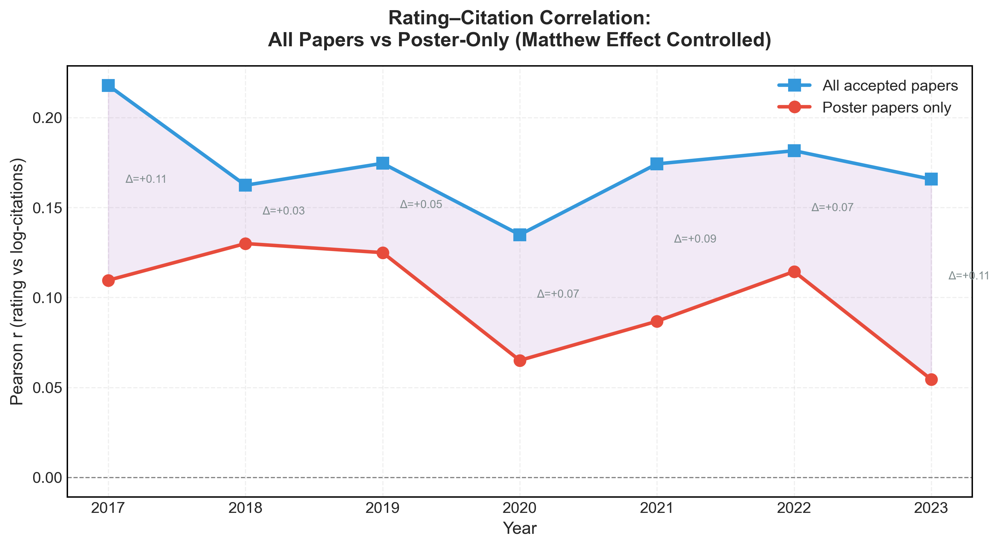
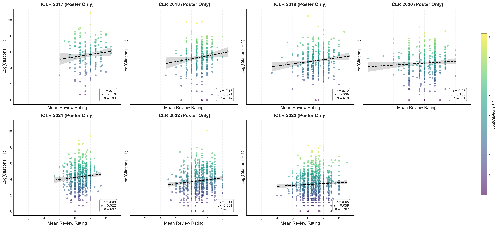

# Poster-Only Correlation Analysis: Controlling for the Matthew Effect

## Motivation

The overall correlation between review ratings and citations (r ≈ 0.17–0.22) may be inflated by the **Matthew Effect**: Oral/Spotlight papers receive disproportionate visibility, which drives extra citations irrespective of score. By restricting the analysis to **Poster papers only** (excluding "Invite to Workshop Track" papers in 2017–2018), we remove this label-driven confound and measure the *direct* relationship between review quality signal and subsequent impact.

---

## Results

### Year-by-Year Comparison

| Year | n(all) | r(all) | sig | n(poster) | r(poster) | sig | Δr     |
|------|--------|--------|-----|-----------|-----------|-----|--------|
| 2017 | 198    | 0.218  | **  | 183       | 0.110     | ns  | +0.108 |
| 2018 | 337    | 0.162  | **  | 314       | 0.130     | *   | +0.032 |
| 2019 | 502    | 0.175  | *** | 478       | 0.125     | **  | +0.050 |
| 2020 | 687    | 0.135  | *** | 531       | 0.065     | ns  | +0.070 |
| 2021 | 859    | 0.174  | *** | 692       | 0.087     | *   | +0.087 |
| 2022 | 1094   | 0.182  | *** | 865       | 0.114     | *** | +0.067 |
| 2023 | 1573   | 0.166  | *** | 1202      | 0.054     | ns  | +0.111 |

### Summary Statistics
- **Mean r(all papers)**: 0.173
- **Mean r(poster only)**: 0.098
- **Mean drop**: +0.075 (**43% reduction**)
- Poster-only correlation significant (p < 0.05) in **4/7 years**

---

## Figures

### Correlation Trend: All Papers vs Poster-Only

### Scatter Grid: Poster Papers Only

---

## Key Findings

1. **The Matthew Effect is substantial (43% drop).** When removing Oral/Spotlight papers, the average rating–citation correlation drops from ~0.17 to ~0.10.

2. **The "strong early correlation" was an artifact.** Previously, we observed a correlation of ~0.30–0.38 in 2017–2018. After excluding Workshop papers (which were inflating the correlation by being low-rated / low-cited), the correlation for 2017 drops to 0.22 (all) and 0.11 (poster-only).

3. **Poster-only signal is weak but present.** Among poster papers, the correlation is consistently low (r ≈ 0.10) but positive. It is statistically significant in 4 out of 7 years.

4. **2023 signal is vanishing.** With r = 0.054 (ns), the review score's predictive power among poster papers is effectively zero in the most recent year.

## Conclusion

The observed correlation between review ratings and citations is partially inflated by the prestige-driven Matthew Effect (Oral/Spotlight boost). Controlling for this drops the correlation by nearly half. Furthermore, the strong correlation previously observed in early years (2017–2018) was largely driven by the distinct "Invite to Workshop Track" tier; removing it reveals that the review signal for standard Poster papers has always been modest (r ≈ 0.10–0.13) and is declining further as the conference scales.
