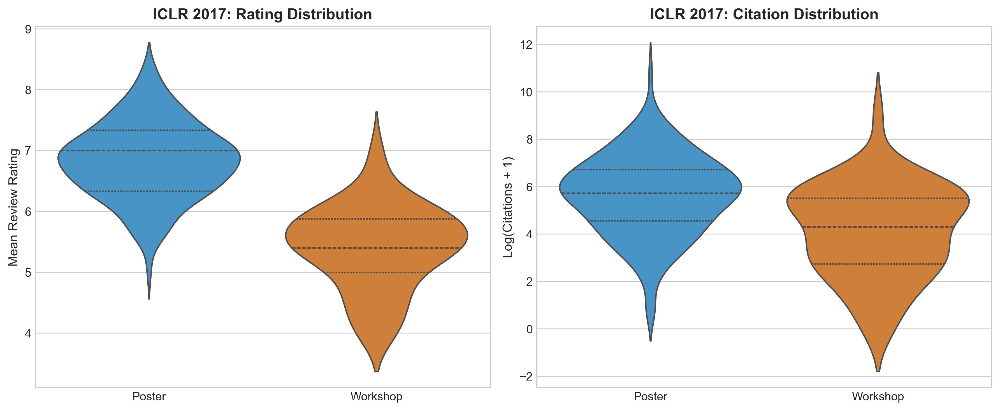
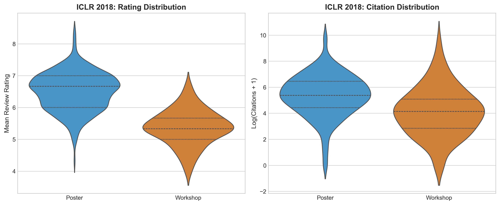

# Should "Invite to Workshop Track" Be Classified as Poster?

## Question
In ICLR 2017–2018, papers labeled "Invite to Workshop Track" exist alongside "Accept (Poster)" and "Accept (Oral)". We previously classified Workshop papers as Poster. Is this appropriate?

---

## Findings: **No — Workshop papers are fundamentally different from Poster papers.**

### Distribution Comparison

|                       | 2017 Poster | 2017 Workshop | 2018 Poster | 2018 Workshop |
|-----------------------|-------------|---------------|-------------|---------------|
| **n**                 | 183         | 47            | 314         | 90            |
| **Mean rating**       | 6.83        | 5.41          | 6.50        | 5.37          |
| **Median rating**     | 7.00        | 5.40          | 6.67        | 5.33          |
| **Rating range**      | 5.0–8.3     | 4.0–7.0       | 4.3–8.3     | 4.0–6.7       |
| **Mean citations**    | 1118.5      | 329.9         | 703.3       | 425.3         |
| **Median citations**  | 305         | 73            | 216         | 62            |
| **Mean log(cit+1)**   | 5.65        | 4.11          | 5.35        | 4.12          |

### Statistical Tests (all p < 0.001)

| Test                          | 2017          | 2018          |
|-------------------------------|---------------|---------------|
| KS test (ratings)             | D=0.794, p<.001 | D=0.692, p<.001 |
| t-test (ratings)              | t=13.8, p<.001  | t=16.2, p<.001  |
| KS test (log-citations)       | D=0.342, p<.001 | D=0.377, p<.001 |
| Mann-Whitney U (citations)    | p<.001          | p<.001          |

### Regression with Workshop as Separate Dummy

When Workshop is kept as its own category (reference = Poster):

**ICLR 2017**: `log_cit ~ mean_rating + C(label)`

| Variable     | Coef   | p-value |
|-------------|--------|---------|
| Intercept   | 2.857  | 0.016 * |
| Workshop    | **-0.954** | **0.011 *** |
| Oral        | 0.957  | 0.060 ns |
| mean_rating | 0.408  | 0.018 * |

**ICLR 2018**: `log_cit ~ mean_rating + C(label)`

| Variable     | Coef   | p-value |
|-------------|--------|---------|
| Intercept   | 2.695  | 0.003 ** |
| Workshop    | **-0.772** | **0.002 *** |
| Oral        | 0.561  | 0.148 ns |
| mean_rating | 0.408  | 0.003 ** |

The Workshop dummy is **highly significant and negative** in both years, indicating that Workshop papers receive substantially fewer citations than Poster papers even after controlling for rating.

---

## Figures

### ICLR 2017

### ICLR 2018

---

## Conclusion

> **★ Merging Workshop and Poster is NOT appropriate.**

Workshop Track papers are a **distinct, lower-tier population** compared to Poster papers:

1. **Much lower ratings**: Workshop mean rating is ~1.1–1.4 points below Poster (5.4 vs 6.5–6.8). Their rating distributions barely overlap.
2. **Substantially fewer citations**: Median citations are 3–4× lower for Workshop papers (62–73 vs 216–305).
3. **Statistically significant regression penalty**: Workshop papers receive ~0.8–1.0 log-citation units fewer than Poster papers after controlling for rating (≈ 2–2.7× citation multiplier difference).

### Recommendation

The "Invite to Workshop Track" label represents a **separate, lower acceptance tier** — not an alternative label for Poster. For analyses involving 2017–2018:

- **Option A (Recommended)**: Exclude Workshop papers entirely. They are a distinct tier that does not exist in later years.
- **Option B**: Keep Workshop as a separate label/dummy in regressions.
- **Option C (NOT recommended)**: Merge with Poster. This dilutes the Poster group, artificially lowers the Poster-group mean rating and citations, and inflates the apparent explanatory power of the rating variable.
