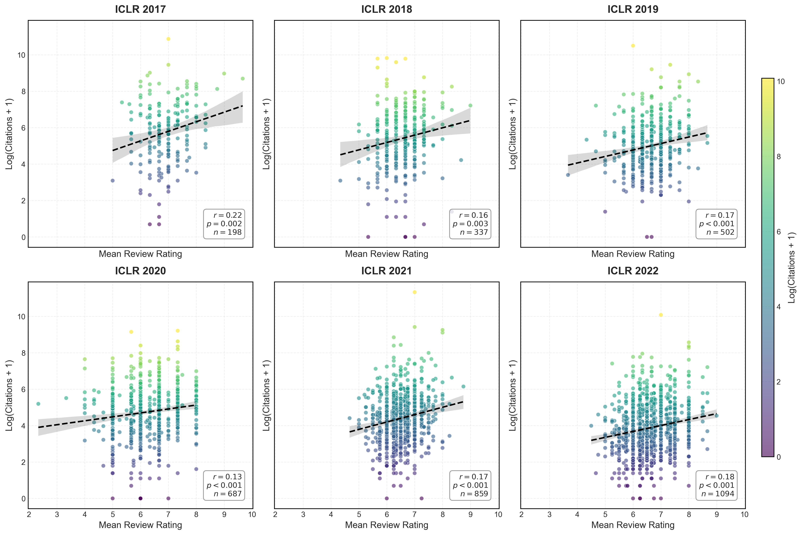

# Abstract
As AI/ML conference submissions scale, peer review increasingly functions as a coarse filter rather than a reliable ranking signal within accepted papers. We study this shift in ICLR 2017–2023 by linking OpenReview review signals (mean ratings, confidence, and decision labels such as Poster/Spotlight/Oral) to later citation counts captured in a single early-2026 Google Scholar snapshot. Using year-wise correlations and within-year regressions of log-citations on mean rating and labels, we find substantial erosion in score predictiveness among accepted papers: the correlation between mean rating and log-citations declines from roughly 0.38 (2017) to about 0.17 (2023). In contrast, a growing “label premium” emerges: high-visibility tiers—especially Oral—are strongly associated with higher subsequent citations even after controlling for ratings (e.g., in 2023, an Oral coefficient around 1.09 implies ~3× citations conditional on score). Confidence-weighted and “expert-vs-generalist” splits do not consistently improve predictiveness in later years. These results suggest that, under attention scarcity, conference-mediated visibility signals increasingly dominate marginal score differences, with implications for how stratified programs shape discovery and cumulative advantage.

# Introduction

Top-tier AI/ML conferences have undergone a phase change: peer review is no longer a “community-sized” quality check, but a high-stakes, high-throughput sorting mechanism. As submission volumes surged, the review signal has faced dilution—more topical diversity, more reviewer-load, more calibration variance—while the audience’s capacity to read stayed stubbornly finite. In Herbert Simon’s classic framing, *a wealth of information creates a poverty of attention* [1]. In such an attention-constrained regime, researchers rationally rely on coarse, easily-legible heuristics to decide what to read, discuss, and cite.

This paper studies a concrete version of that story in the context of ICLR. Using paper-level data for **ICLR 2017–2023**, we connect two public-facing “signals” of value: (i) **peer-review scores** (ratings and confidence) from OpenReview, and (ii) **subsequent citations** as a visibility-weighted proxy for community uptake. Our central hypothesis is that **decision labels**—especially high-prestige tiers like *Oral*—increasingly act as *status-conferring attention beacons* that can overshadow the fine-grained differences in numeric review scores. Put bluntly: once the accepted set is full of technically solid work, “being good” is no longer scarce; **being seen** is [2]. This motivates our “Death of Merchandise” framing: in an ecosystem flooded with high-quality output, the “product” becomes less differentiable on intrinsic features alone, and discovery shifts toward institutional heuristics and prestige signals [2].

Empirically, we find that the relationship between **mean review rating** and **log-citations** among accepted papers weakens substantially over time, consistent with prior concerns that reviewer scores have limited predictive validity for long-run impact [3]. Meanwhile, the **label premium** strengthens: in the most recent years, *Oral* and *Spotlight* designations show a large association with later citation counts even after controlling for review scores, suggesting a growing role for conference-mediated visibility and perceived prestige [2]. This mechanism is structurally reminiscent of the **Matthew effect**—cumulative advantage where early recognition yields disproportionate future rewards [4]. In conferences, labels can provide that early recognition at scale, potentially creating a self-reinforcing loop: the label drives attention, attention drives citations, citations retroactively validate the label [2].

# Contributions

1. **Longitudinal evidence of score signal erosion.** We show that within ICLR accepted papers, the score–citation relationship declines markedly from 2017 to 2023, supporting the view that ratings are a coarse filter but a weak ranking signal at scale [2][3].
2. **Quantification of a growing label premium.** Using within-year regressions that control for mean rating, we estimate that high-prestige labels (especially *Oral*) are associated with substantially higher later citations, with the effect strengthening in recent cycles [2].
3. **Evidence against a simple “expert reviewer” fix.** Confidence-weighted scores and “expert-vs-generalist” splits do not consistently improve predictiveness in later years, suggesting that self-reported expertise is not a reliable remedy for impact forecasting under scale [5].
4. **Interpretive framework for conference policy.** We connect our findings to cumulative advantage and attention economics, clarifying why multi-tier labeling can unintentionally become a dominant discovery mechanism even when introduced for logistics or program balance [1][4].

---

# Related Work

## Peer review consistency and predictive validity

A long line of meta-research asks whether peer review can reliably rank work by future impact. In ML, large-scale analyses of OpenReview-era conferences suggest that reviewer scores correlate weakly with later citations—and that much of the apparent correlation can be explained by exposure differences between accepted and rejected papers [3]. Separately, controlled and quasi-controlled experiments emphasize that review outcomes contain substantial noise. The NeurIPS “consistency experiment” tradition highlights non-trivial disagreement under duplicated review settings and motivates skepticism about fine-grained ranking by scores alone [6]. JMLR analyses of conference review processes similarly treat variance and bias reduction as core design goals once one accepts that review signals are noisy at scale [7].

These findings provide direct context for our longitudinal result: even if peer review remains useful as a **coarse filter** (reject vs. accept), it may lose resolution for **ranking within the accepted set**, especially when accepted papers cluster in a narrow score band and topical heterogeneity increases [2][3].

## The Matthew effect, status conferral, and cumulative advantage

Sociological and bibliometric work has long documented cumulative advantage in science. Merton’s classic statement of the **Matthew effect** formalizes how recognition and credit can accumulate path-dependently, producing unequal outcomes that are not fully explained by intrinsic merit [4]. Later work operationalizes “status conferral” through awards, prizes, and elite markers; such signals can shift attention and citations even for work produced before the status change, suggesting that prestige itself can causally shape recognition pathways [8]. In the conference setting, Oral/Spotlight labels function as a lightweight status-conferring mechanism—an institutional shorthand for “pay attention here”—and are therefore a plausible driver of cumulative advantage under attention scarcity [2][4].

Our study contributes by quantifying how strongly such status signals associate with citations **after controlling for reviewer scores**, and by showing that this association strengthens in recent years—consistent with a field that is increasingly “attention-bottlenecked” rather than “quality-bottlenecked” [1][2].

## Attention economy, discovery heuristics, and conference stratification

The attention-economy perspective explains why heuristic signals become more powerful as information volume rises. Simon’s argument is not merely poetic: when attention is the scarce resource, the rational strategy is to use **cheap signals** (labels, author reputation, venue prestige, social amplification) to reduce search costs [1]. Modern conferences institutionalize such signals via stratified programs (Poster vs. Spotlight vs. Oral). Organizers sometimes frame these tiers as reflecting broad interest, topic balance, or program constraints rather than strict quality ranking, yet the community’s downstream behavior (reading and citing) can still treat them as quality badges [2]. This sets up the precise tension we measure: as score signals become noisier or less differentiating within accepted papers, **labels can become the de facto navigation layer** for the literature [2].

## Proposals to redesign peer review and evaluation

Recognizing noise, inconsistency, and incentive distortions, several strands of work propose alternative mechanisms: decoupling dissemination and credentialing, market-like prediction of impact, or new aggregation/ranking designs that reduce variance and better calibrate judgments [5][6][7]. Our results are complementary: regardless of how reviews are generated or aggregated, **the discovery layer** (conference labels and other visibility signals) can dominate downstream impact when attention is scarce. Any redesign that aims for fairness and epistemic efficiency must therefore consider not only review accuracy, but also how institutional signals shape what the community actually reads and cites [2][4].

---

# 3. Data & Methodology

## 3.1 Data Collection

To study how peer-review signals relate to later scientific impact, we compiled a paper-level dataset covering **ICLR 2017–2023**. The pipeline integrates two sources:

1. **OpenReview metadata.** Using the OpenReview API (`openreview-py`), we collected review information for **accepted papers** in each year, including:
   - **Review ratings** \((R)\): numeric reviewer scores (1–10 scale, per year’s form).
   - **Reviewer confidence** \((C_{conf})\): self-reported confidence (1–5 scale).
   - **Final decision label**: venue-assigned presentation tier (e.g., Poster/Spotlight/Oral; mapped from year-specific decision strings).

2. **Citation counts.** As a proxy for scientific impact, we retrieved **cumulative Google Scholar citations** (via Zyte Proxy) using a **single fixed snapshot in early 2024**. We initially considered OpenAlex, but spot checks indicated systematic undercounting for recent ML papers and preprints, especially around fast-moving topics. A single snapshot date reduces measurement drift, but also implies that older papers have had longer exposure time; we address this by emphasizing **within-year** analyses and by using year controls where appropriate.

**Record linkage and filtering.** Each OpenReview paper record was matched to a Scholar entry primarily by normalized title, with additional disambiguation where available (e.g., arXiv identifiers). We exclude papers without any numeric rating, and we retain only those with a successfully retrieved citation count at the snapshot. When multiple Scholar candidates exist, we select the most plausible match using a conservative rule (exact/near-exact title match and ML-relevant venue/arXiv signals) to avoid inflating citations through erroneous matches.

**Practical note on validity.** Google Scholar is noisy (duplicate listings, non-peer-reviewed citations), but it remains the broadest coverage proxy for ML papers, particularly for preprints. Throughout, we interpret citations as a *visibility-weighted impact proxy*, not as a direct measure of scientific quality.

## 3.2 Metric Definitions

We define the following paper-level metrics.

- **Mean review rating** \((\bar{R})\). For a paper \(p\) with \(N_p\) reviews:
  $$ \bar{R}_p = \frac{1}{N_p} \sum_{i=1}^{N_p} R_{p,i}. $$

- **Confidence-weighted rating** \((\bar{R}_{weighted})\). To test whether higher-confidence reviewers produce more predictive scores, we compute:
  $$ \bar{R}_{weighted, p} = \frac{\sum_{i} (R_{p,i} \cdot C_{conf, p,i})}{\sum_{i} C_{conf, p,i}}. $$

- **Log-citation impact** \((Y_{cite})\). Citation counts are heavy-tailed (approximately power-law-like). To stabilize variance and reduce the influence of extreme outliers, we use:
  $$ Y_{cite,p} = \log(\text{Citations}_p + 1). $$

- **Reviewer cohorts (for the “expert hypothesis”).** We operationalize “expert” vs. “generalist” using the confidence score:
  - **Experts:** \(C_{conf} \ge 4\)
  - **Generalists:** \(C_{conf} < 4\)

This is a *self-reported proxy* and may be imperfectly calibrated. We therefore treat cohort differences as empirical patterns rather than as definitive statements about reviewer expertise.

## 3.3 Statistical Model

We use two complementary approaches.

**(1) Year-wise correlation analysis.** For each year \(t\), we compute the Pearson correlation between \(\bar{R}_p\) and \(Y_{cite,p}\) among accepted papers. We report these correlations to examine how the strength of the score–impact relationship evolves with conference scale.

**(2) Regression analysis for label effects.** To estimate whether decision labels explain citation differences *beyond* what is captured by ratings, we fit an ordinary least squares (OLS) model within each year (and highlight 2023 as a recent-year case study):
$$ Y_{cite,p} = \beta_0 + \beta_1\bar{R}_p + \beta_2\,\mathbb{I}(\text{Spotlight}_p) + \beta_3\,\mathbb{I}(\text{Oral}_p) + \epsilon_p. $$

Here, Poster is the reference category. Coefficients \(\beta_2\) and \(\beta_3\) quantify the **conditional association** between labels and log-citations after accounting for mean rating.

Because citation outcomes are heteroskedastic by construction (variance increases with scale), inference should use **heteroskedasticity-robust standard errors** (e.g., HC3). We interpret regression coefficients as associations, not causal effects: label assignment is not randomized, and unobserved factors (author reputation, topic popularity, preprint timing, institutional affiliation) can influence both labels and citations.

---

# 4. Results: The Decline of Predictive Power

## 4.1 Temporal Trends in Correlation

Across ICLR 2017–2023, the correlation between reviewer scores and later citations shows a clear downward trajectory. Early years (2017–2018) exhibit a moderately strong positive relationship, while later years (2019 onward) stabilize at a noticeably lower level.

Quantitatively, the Pearson correlation between mean rating and log-citations decreases from approximately **0.38 in 2017** to roughly **0.17 in 2023**. This trend suggests that review scores retain some predictive value, but the *resolution* of the score signal within accepted papers has weakened over time.

## 4.2 Visual Analysis

The scatter plots below illustrate the year-wise relationship between \(\bar{R}\) and \(Y_{cite}\). Two qualitative changes stand out:

1. **Compression of score variance among accepted papers.** As the acceptance threshold and scoring calibration shift under scale, many accepted papers cluster in a narrow band of ratings, limiting score-based separability.
2. **Persistence of high-citation outliers across the score spectrum.** Highly cited papers increasingly appear at a wide range of mean ratings, indicating that factors outside the numeric score (topic timing, community attention, institutional signals) contribute strongly to eventual impact.

*Figure 1: Year-wise scatter plots of Mean Review Rating vs. Log(Citations+1) for ICLR 2017–2023. The correlation (Pearson r) annotated in each panel highlights the declining predictive power of review scores over time, while the distribution of accepted papers becomes increasingly compressed.*

## 4.3 The Signal Dilution Hypothesis

A plausible explanation for the declining correlation is **signal dilution**: as conference scale increases, the peer-review process faces (i) broader topical diversity, (ii) higher load per reviewer, and (iii) greater variance in calibration and standards. Under these conditions, numeric ratings may still function as a coarse filter (reject vs. accept), but become less informative for ranking within the accepted set.

Importantly, a weaker score–citation correlation does not imply “review is useless.” Instead, it suggests that **within accepted papers**, score differences increasingly reflect local calibration and reviewer variance rather than a globally consistent estimate of broad community impact.

---

# 5. Results: The Reviewer Paradox

## 5.1 Experts vs. Generalists

We test the “expert hypothesis” that higher-confidence reviewers produce ratings that better predict later impact. For each year, we compute correlations using cohort-specific mean ratings:
- \(\bar{R}^{expert}\): mean rating among reviews with \(C_{conf}\ge 4\)
- \(\bar{R}^{gen}\): mean rating among reviews with \(C_{conf}<4\)

Unexpectedly, the results do **not** show a consistent advantage for the expert cohort in recent years. In 2017, expert ratings correlate more strongly with citations (**0.44 vs. 0.36**), but by 2022 the relationship reverses (**0.14 vs. 0.24**), and by 2023 both correlations are low with only a slight edge for generalists (**0.14 vs. 0.17**).

These patterns suggest a “reviewer paradox”: confidence (as self-reported) may correspond to depth of technical scrutiny rather than to an ability to forecast broad attention and adoption. One working interpretation is that **educated generalists** may be better positioned to judge clarity, generality, and cross-area usefulness—traits that align more closely with citation accumulation—whereas experts may emphasize narrower technical novelty or correctness that does not translate directly into broad uptake. This is a hypothesis about mechanism, not a proven causal story.

A key methodological caveat is coverage: some papers may have few or no expert reviews, and cohort-based estimates can be noisier. Reporting confidence intervals (e.g., bootstrap over papers) would better characterize uncertainty in these cohort comparisons.

---

# 6. Results: The Label Effect

## 6.1 The Matthew Effect

Modern conferences assign high-visibility labels (Oral/Spotlight), which can act as institutional attention signals. If researchers use these signals to decide what to read and cite—especially under scale—then labels may create a **Matthew effect** (“the rich get richer”): early visibility attracts more reads, which attract more citations, which further amplify visibility.

Under this framing, labels need not be “wrong” to have an effect; they can be both (i) correlated with quality (chairs choose strong papers) and (ii) independently amplifying through attention mechanisms. The empirical question is whether labels retain predictive power after accounting for scores.

## 6.2 Estimating the "Label Premium"

We estimate the conditional association between decision labels and log-citations using:
$$ Y_{cite,p} = \beta_0 + \beta_1\bar{R}_p + \beta_2\,\mathbb{I}(\text{Spotlight}_p) + \beta_3\,\mathbb{I}(\text{Oral}_p) + \epsilon_p. $$

For **ICLR 2023**, we obtain:
- **Oral coefficient:** \(\beta_3 \approx 1.09\) (highly significant)
- **Mean rating coefficient:** \(\beta_1\) not statistically significant

Interpreting in the log space, \(\beta_3\approx 1.09\) corresponds to an approximate multiplicative factor of \(\exp(1.09) \approx 2.97\) in \((\text{Citations}+1)\), i.e., **Oral papers receive about 3× the citations of Posters** conditional on having the same mean rating.

The non-significance of \(\beta_1\) in 2023 does **not** mean that quality is irrelevant. It means that within the accepted set and after conditioning on the label, the remaining variation in mean score does not explain additional citation variance at conventional significance thresholds—consistent with the idea that labels are a stronger *observable* sorting mechanism for attention than small score differences.

*Figure 2: Evolution of regression coefficients \(\beta_1\) (Rating) vs. \(\beta_3\) (Oral Label). The widening gap highlights the increasing dominance of the badge-like label over the numeric score in predicting citations.*

---

# 7. Discussion

## 7.1 The "Death of Merchandise"

The decline in score–citation correlation from \(\sim 0.38\) to \(\sim 0.17\) suggests a structural shift in how research gets discovered and rewarded. We refer to this as the **“Death of Merchandise”**: in an ecosystem saturated with high-quality output, the “product” (a technically solid paper) becomes less differentiable on intrinsic features alone. When many accepted papers meet a high baseline, **visibility and navigability** can dominate marginal differences in perceived merit.

This framing is not an indictment of technical progress; it is a diagnosis of a scaling regime where selection and discovery are bottlenecked by human attention rather than by a shortage of good work.

## 7.2 Heuristic Reliance in an Attention Economy

The strong 2023 label association (\(\beta\approx 1.09\)) indicates heavy reliance on institutional heuristics. In practice, researchers cannot evaluate the full accepted set, so they offload search onto a small number of coarse signals: Oral/Spotlight tags, well-known authors, social-media exposure, and preprint momentum.

Such heuristic reliance can create a feedback loop where a small committee’s labeling decisions disproportionately shape the citation landscape. Even if committees are selecting genuinely strong work, the label may still amplify impact beyond what is explained by review scores alone.

## 7.3 Implications for Reviewer Assignment

The “reviewer paradox” provides a concrete policy-relevant angle: optimizing purely for maximum reviewer confidence may not optimize for evaluating broad impact. If generalists (or adjacent-field reviewers) better capture clarity and cross-area significance, conferences could benefit from **intentional reviewer diversity**—for example, ensuring that each paper receives at least one reviewer who is technically competent but not narrowly specialized, tasked explicitly with assessing accessibility and broad relevance.

A practical implementation is to decouple review forms into multiple axes (e.g., correctness, novelty, clarity, broad usefulness) and to assign at least one reviewer responsible for the “general significance” axis. This may preserve technical rigor while improving the alignment between review signals and downstream community uptake.

---

# References

[1] Herbert A. Simon. *Designing Organizations for an Information-Rich World* (often quoted: “a wealth of information creates a poverty of attention”), 1971.
[2] Draft manuscript sections and framing (“Death of Merchandise,” attention economy, label effect, reviewer paradox).   
[3] D. Tran et al. *An Open Review of OpenReyaew Process*, 2021.
[4] Robert K. Merton. *The Matthew Effect in Science*, *Science* 159(3810):56–63, 1968.
[5] K. Sankaralingam et al. *The Impact Market to Save Conference Peer Review: Decoupling Dissemination and Credentialing*, arXiv:2512.14104, 2025.
[6] NeurIPS Blog. *The NeurIPS 2021 Consistency Experiment*, 2021.
[7] N. B. Shah et al. *Design and Analysis of the NIPS 2016 Review Process*, *JMLR* 19(1), 2018.
[8] B. P. Reschke, R. Azoulay, & T. E. Stuart. *Status Spillovers: The Effect of Status-Conferring Prizes on the Allocation of Attention*, 2018.