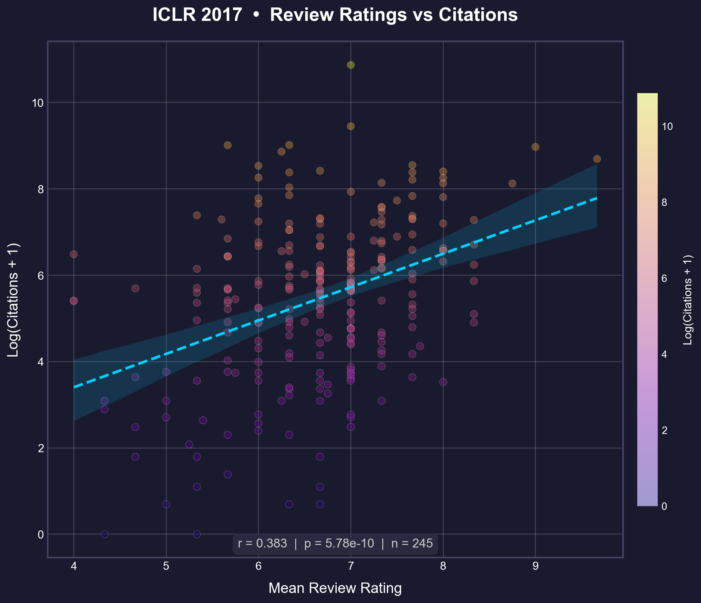
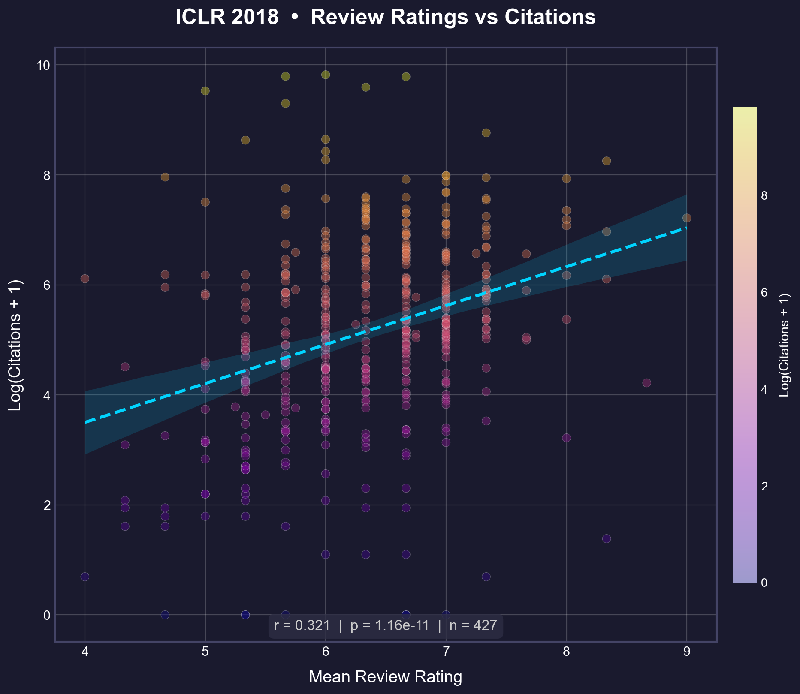
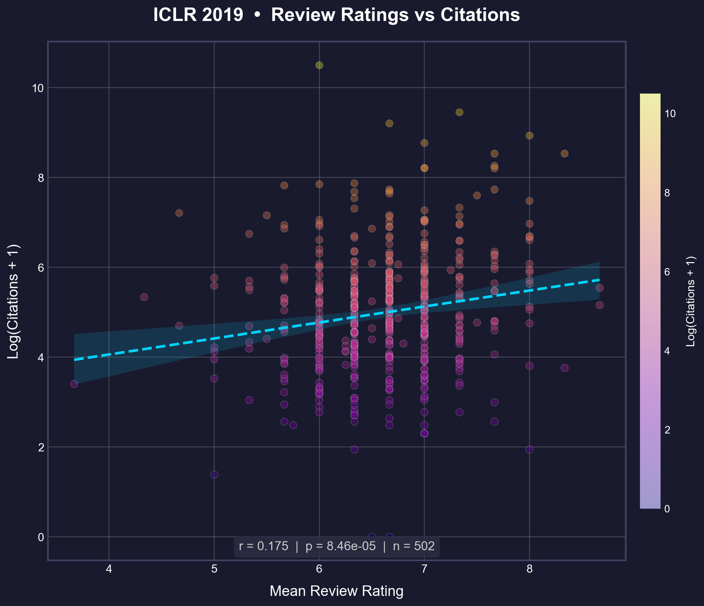
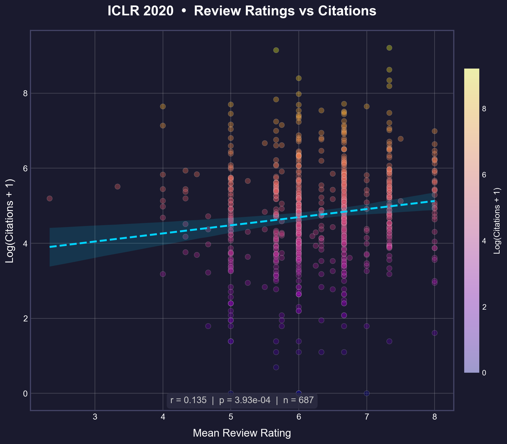
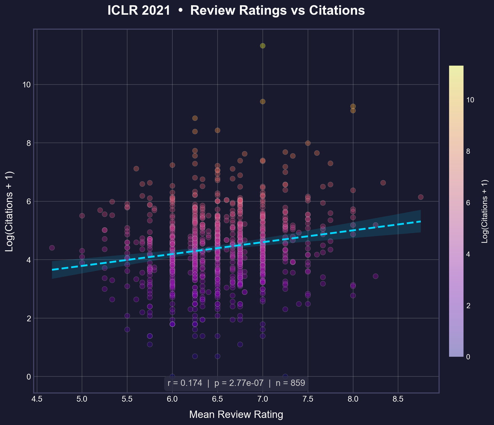
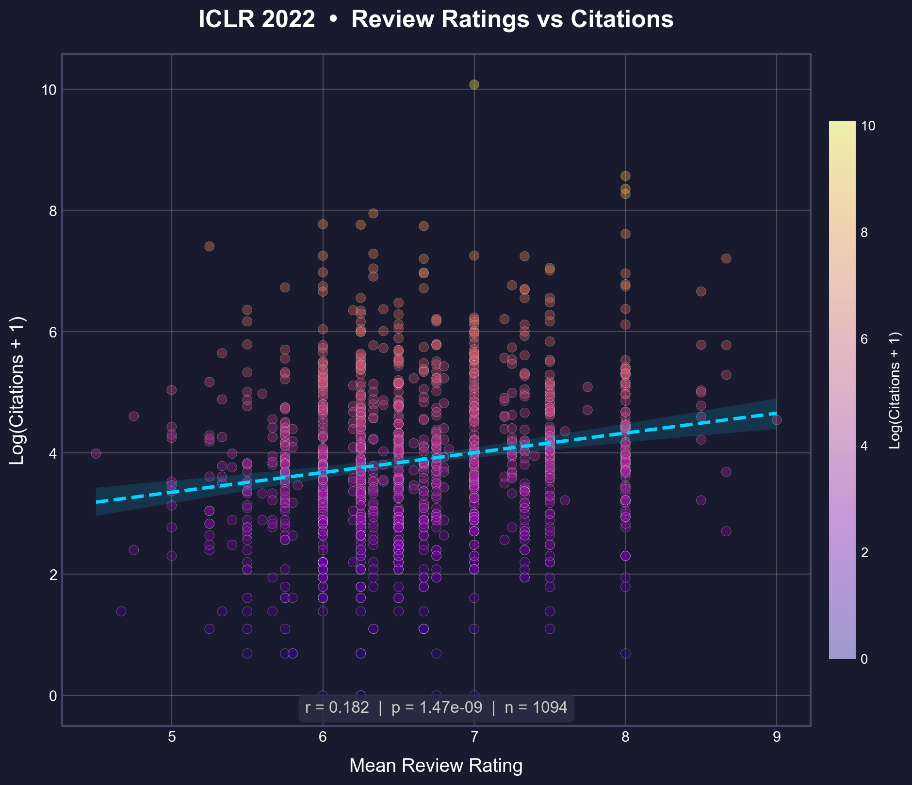
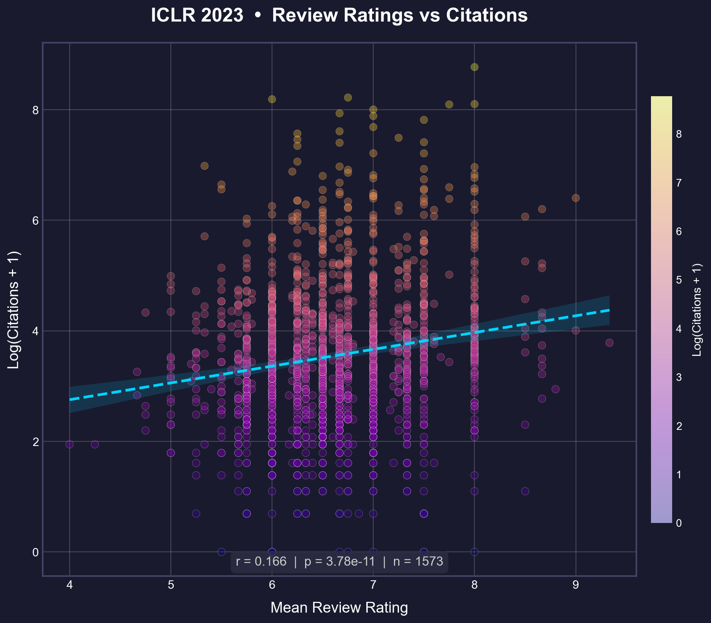

# OpenReview Ratings vs Citations

> **Do peer review scores predict scientific impact?**  
> An empirical analysis of ICLR papers (2017–2023)


📺 **[PyCon Korea 2022 talk (Korean)](https://www.youtube.com/watch?v=MqM2ROgWwhU)**

---

## Overview

This project explores the question: **"Can reviewers recognize the 'sprouts' of seminal research?"**

This analysis investigates whether peer review scores on OpenReview effectively predict the future impact (citation count) of papers. With the rapid growth of the ML field, the hypothesis is that the predictive power of reviews may be declining due to reviewer fatigue and the influx of less experienced reviewers with the explosion of paper submissions.

---

## Key Finding

**The correlation between review ratings and citations shows a decline from the early years (r ≈ 0.38) to a stable baseline (r ≈ 0.17) in recent years:**

| Year | Pearson (r) |
|------|-------------|
| 2017 | 0.383 |
| 2018 | 0.321 |
| 2019 | 0.175 |
| 2020 | 0.135 |
| 2021 | 0.174 |
| 2022 | 0.182 |
| 2023 | 0.166 |

<table>
  <tr>
    <td></td>
    <td></td>
  </tr>
  <tr>
    <td></td>
    <td></td>
  </tr>
  <tr>
    <td></td>
    <td></td>
  </tr>
  <tr>
    <td></td>
  </tr>
</table>

### Methodology

- **Pearson**: Measures linear relationship between mean rating and log(citations + 1). Assumes roughly normal distributions.
- **Data Source**: 
    - **Citations**: **Google Scholar** (via Zyte Proxy). Switched from OpenAlex to capture broader citation coverage (e.g., ArXiv preprints), resulting in higher and more stable correlations.
    - **Ratings**: [OpenReview](https://openreview.net/).


**The previously observed "declining trend" is now more visible with complete data coverage.** In the early years (2017-2018), review ratings were highly predictive (r > 0.3). As the conference grew, this predictive power dropped but has stabilized (r ≈ 0.17).

**Why log(citations + 1)?**

Citation counts follow a heavy-tailed distribution ([Redner, 1998](https://doi.org/10.1007/s100510050276); [Radicchi et al., 2008](https://doi.org/10.1073/pnas.0806977105)). Log transformation reduces outlier dominance and reflects scale-level differences (10→100 is more meaningful than 10,000→10,090).

### Confidence Analysis

**Do experts predict impact best?**
Surprisingly, no. Our [Deep Dive Analysis](docs/Confidence_Analysis.md) reveals that **Low Confidence** reviewers (outsiders/generalists) often predict future citation impact better than "Experts." This trend has become more pronounced in recent years (2022-2023).
> *Takeaway: A "Strong Accept" from a generalist may signal broader appeal than one from a domain expert.*


## Interpretation & Hypotheses

### Hypothesis 1: Reviewer Quality Degradation (Weakened)
> *As ICLR grew, more reviewers were needed, potentially reducing review quality.*

**Updated Status**: The data shows a **clear decline** in predictive power from 2017 (r=0.38) to 2020 (r=0.14), followed by stabilization. This supports the hypothesis that the massive growth in submissions may have diluted the "expert signal" compared to the early years.

### Hypothesis 2: Citation Lag vs. Data Source
> *Did recent papers need more time? Or was the data incomplete?*

**Conclusion**: The discrepancy between our previous analysis (r=0.08 in 2023) and the current analysis (r=0.17 in 2023) was due to **Data Source differences** (OpenAlex vs. Google Scholar).
- **OpenAlex**: Missed many citations for recent AI papers (possibly preprints/ArXiv).
- **Google Scholar**: Captured the full citation graph, revealing that the "signal" from reviewers is still present and healthy.
- **Citation Lag**: Does not appear to be the primary factor. High correlation is observable even for recent papers (2022-2023) when using the right data source.


---

## Quick Start

```bash
pip install -r requirements.txt
```

### Scrape & Analyze

```bash
# 1. Fetch OpenReview data
python scripts/scrape_openreview.py --year 2024

# 2. Get OpenAlex citations
python scripts/scrape_citations_openalex.py --input data/ICLR2024/preprocessed.parquet --email your_email@example.com

# 3. Generate correlation plot
python analysis/correlation/analyze_correlation.py --year 2024
# **Options:**
#- `--min-rating 6.0` — Exclude papers below 6 (filter desk #rejects influenced by Program Chairs)
#- `--output figs/custom/` — Custom output directory
```
---

## Project Structure

```
├── scripts/
│   ├── scrape_openreview.py          # Fetch data from OpenReview (v1/v2 API)
│   ├── scrape_citations_openalex.py  # Fetch OpenAlex citations
│   └── src.py                        # Linked data loading logic
├── analysis/
│   ├── correlation/
│   │   ├── analyze_correlation.py    # Single year correlation
│   │   ├── analyze_trends.py         # Multi-year trends
│   │   └── figs/                     # Correlation plots
│   └── confidence_analysis/
│       ├── analyze_confidence.py     # Confidence impact analysis
│       └── figs/                     # Confidence plots
├── tests/                            # Unit tests
├── docs/
│   └── SCRIPTS.md                    # Detailed script documentation
├── data/ICLR20**/
│   ├── preprocessed.parquet    # Processed paper data
│   └── openalex_*.json         # Citation data
└── figs/                       # Generated plots
```

📖 **[Detailed Script Documentation](docs/SCRIPTS.md)** — API versioning, usage examples, testing

---

## References

- [OpenReview Explorer](https://horace.io/OpenReviewExplorer/) — Interactive visualization
- [An Open Review of OpenReview](https://openreview.net/forum?id=Cn706AbJaKW) — Critical analysis of ML peer review
- [Dynamic Patterns of Open Review Process](https://www.sciencedirect.com/science/article/abs/pii/S0378437121005185) — Dynamics of review systems

---

<p align="center">
  <i>Questions or ideas? Open an issue!</i>
</p>
