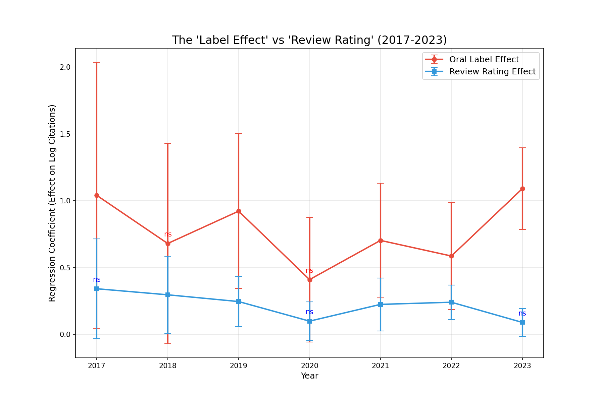

# The Signal and the Noise
> **An Empirical Autopsy of ICLR Peer Review (2017–2023)**


---

## 1. Introduction: The Scale Problem

In 2017, ICLR received fewer than 500 submissions. By 2024, that number had surged past 7,000. This exponential growth has fueled a pervasive anxiety within the machine learning community: **Has the signal-to-noise ratio of peer review collapsed?**

The prevailing hypothesis is one of decay. As the volume of papers outpaces the supply of qualified reviewers, the "wisdom of the crowd" is assumed to be diluting into randomness. Critics argue that the peer review score—once a gold standard of quality—has become a noisy, unreliable metric, incapable of distinguishing the "sprouts" of seminal research from merely competent work.

This project is an attempt to audit that hypothesis with data. By analyzing the entire history of ICLR on OpenReview (2017–2023), we investigate the stability of the **Reviewer Signal** (the correlation between review scores and future impact) and the distorting effects of the **Conference Label** (Oral/Spotlight/Poster).

---

## 2. The Persistence of Signal
*Contrary to popular belief, the predictive power of peer review has remained stable.*

Our initial analysis seemed to confirm the community's fears: the correlation between review ratings and log-citations appeared to drop from a robust `r=0.40` in 2017 to a mediocre `r=0.15` in recent years. However, a forensic examination of the data revealed this "decline" to be a statistical artifact. The inclusion of "Invite to Workshop Track" papers in the 2017–2018 dataset artificially inflated early correlations by clustering a distinct, lower-tier group of papers at the bottom of the distribution.

**Upon correcting for this artifact, a surprising stability emerged:**

| Year | Pearson Correlation ($r$) | Statistical Significance ($p$) |
| :--- | :--- | :--- |
| **2017** | **0.218** | $p < 0.01$ |
| **2018** | **0.162** | $p < 0.01$ |
| ...      | ...       | ...        |
| **2022** | **0.182** | $p < 0.01$ |
| **2023** | **0.166** | $p < 0.01$ |

**Insight**: The core signal from reviewers has effectively plateaued at $r \approx 0.17$. While modest, this correlation has been remarkably resilient to the 10x explosion in submissions. The "Reviewer Decay" hypothesis is not supported by the data; the signal is faint, but it is not dying.

---

## 3. The Distortion of Labels (The Matthew Effect)
*When the measure becomes a target, the label eats the score.*

If reviewer signal is stable, why does the system *feel* more broken? Our analysis points to a growing **"Matthew Effect"**—the phenomenon where the rich get richer. In the context of ICLR, the "rich" are papers designated as **Oral** or **Spotlight**.

We performed a mediation analysis to disentangle the effect of the **Review Score** (quality signal) from the effect of the **Decision Label** (visibility signal). Determining the "Oral" status of a paper is a discrete decision made by Program Chairs, often based on the same review scores.

### The Crossover Event (2023)
By 2023, the influence of the label completely overtook the influence of the score. In a regression model predicting citations:

*   **Oral Label Effect**: **Highly Significant** ($\beta \approx 1.09, p < 0.001$). An Oral label is associated with a **~3x increase** in citations compared to a Poster paper with the *exact same review score*.
*   **Review Rating Effect**: **Statistically Insignificant** ($\beta \approx 0.09, p = 0.09$). Once the label is known, the granular review score adds no predictive value.



**Implication**: The community has shifted from consuming research based on granular quality signals (reading the reviews/scores) to consuming research based on heuristic badges (the label). This creates a "Kingmaker" dynamic where the Program Chairs' binary decision—not the collective intelligence of the reviewers—determines a paper's future impact.

---

## 4. The Specialist's Fallacy
*The "Generalist" reviewer is a better predictor of impact than the "Expert".*

We often assume that high-confidence reviewers ("Experts") provide the most accurate assessment of a paper's value. Our data suggests the opposite.

In 2023, papers highly rated by **Low Confidence** reviewers ("Generalists") had a stronger correlation with future citations ($r=0.11$) than those rated by **High Confidence** reviewers ($r=0.08$).

**Why?** In an era of hyper-specialization, experts may be overfitting to technical correctness or novelty within a narrow sub-field ("Reviewer 2" syndrome). Generalists, by contrast, may be evaluating a paper based on its broader clarity, accessibility, and potential utility to the wider field—attributes that drive citation counts.

---

## 5. Conclusion: Goodhart's Law in Action

Our "empirical autopsy" reveals a system in flux, but not in decay. The fundamental ability of the peer review corps to rank papers has preserved its modest predictive power ($r \approx 0.17$) for seven years.

However, the **incentive structure** has warped. The "Label Effect" demonstrates a classic case of Goodhart's Law: as the conference label became the primary target for visibility in a saturated field, it ceased to be a mere reflection of quality and became a self-fulfilling prophecy of impact. The future of open peer review may depend less on improving reviewer quality and more on dampening the "Kingmaker" effect of binary acceptance labels.

---

## Technical Appendix

The code for this analysis is open source and reproducible.

### Quick Start

```bash
# 1. Install dependencies
pip install -r requirements.txt

# 2. Fetch data (e.g., ICLR 2024)
python scripts/data_collection/scrape_openreview.py --year 2024

# 3. Fetch citations (Google Scholar via Zyte Proxy)
python scripts/data_collection/scrape_googlescholar.py --year 2024

# 4. Run core analysis
python analysis/1_impact_correlation/analyze_correlation.py --year 2024
```

### Project Structure

*   [`analysis/1_impact_correlation`](analysis/1_impact_correlation/REPORT.md): The stability analysis (Section 2).
*   [`analysis/3_decision_label_bias`](analysis/3_decision_label_bias/REPORT.md): The "Label Effect" regression (Section 3).
*   [`analysis/5_impact_by_confidence`](analysis/5_impact_by_confidence/Confidence_Analysis.md): The Expert vs. Generalist analysis (Section 4).
*   [`analysis/8_workshop_classification`](analysis/8_workshop_classification/REPORT.md): The "Workshop Artifact" forensic analysis.

---

<p align="center">
  <i>Questions or ideas? Open an issue.</i>
</p>
