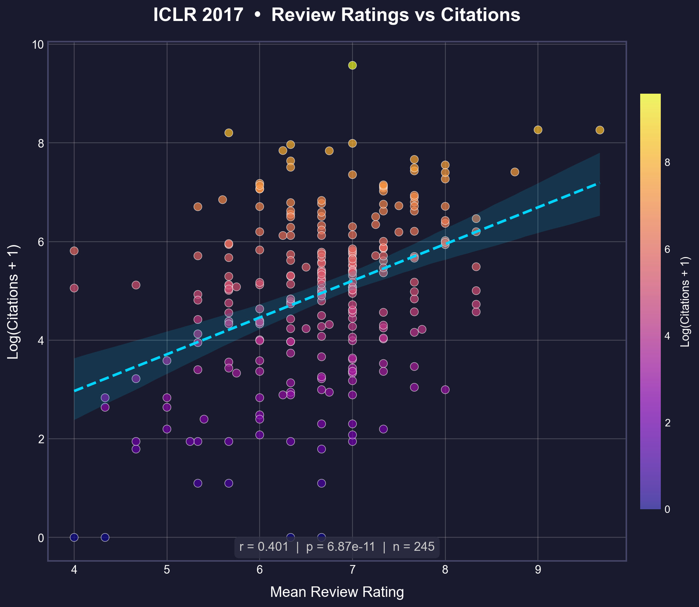
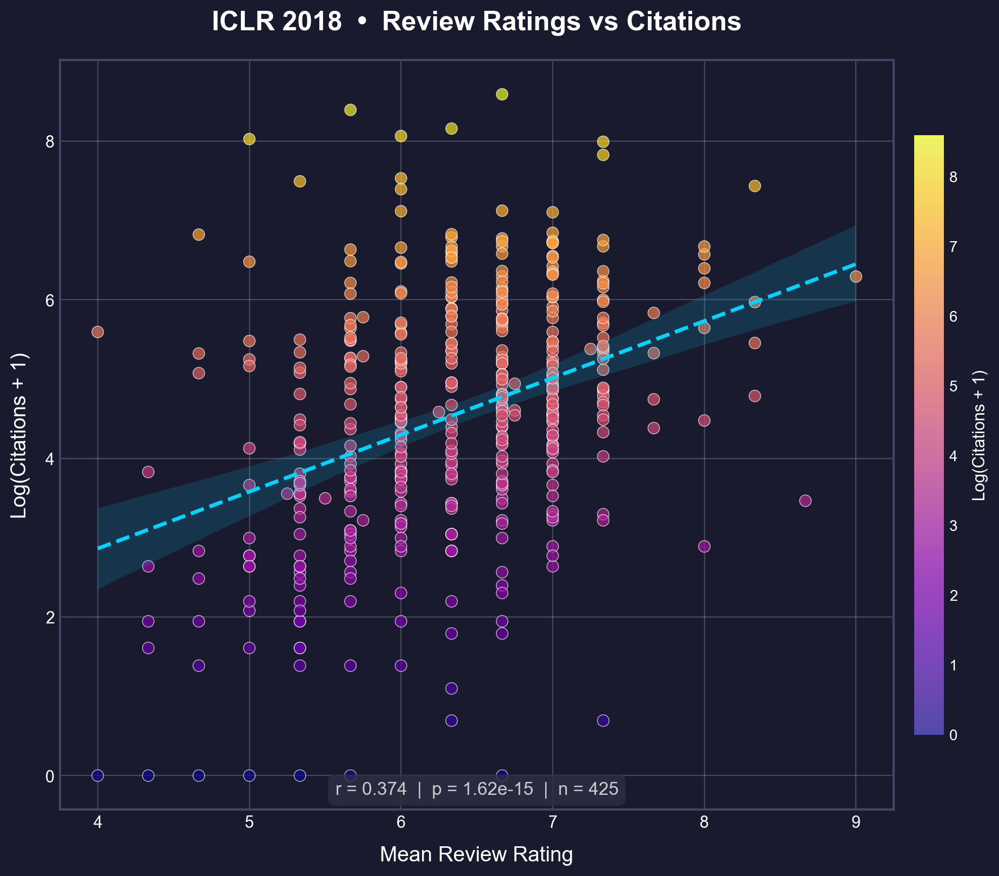
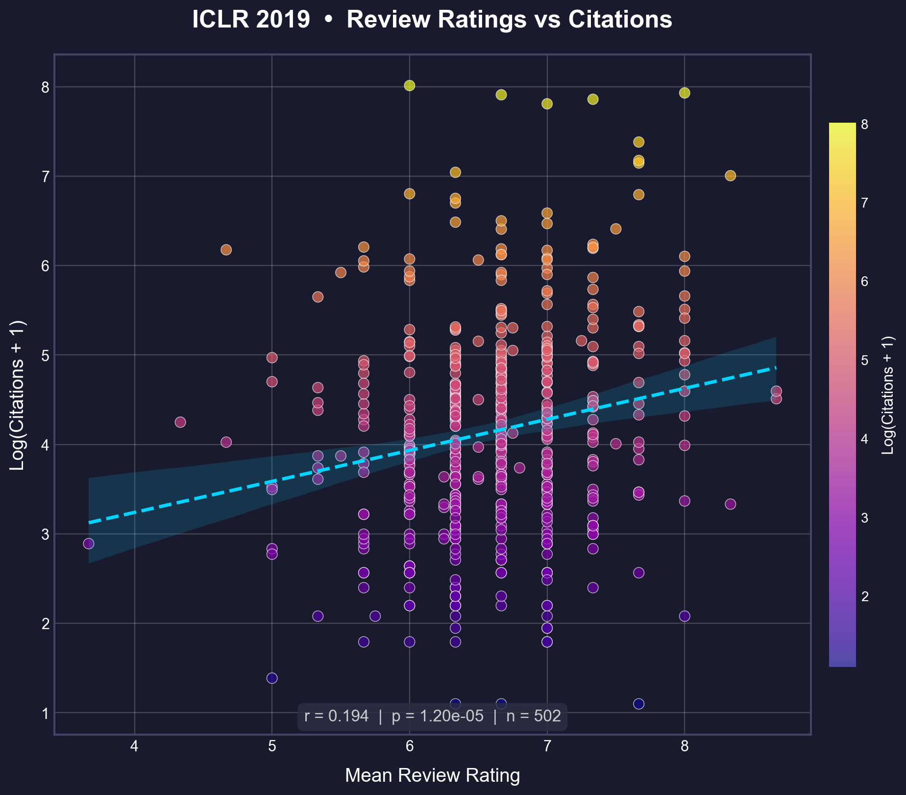
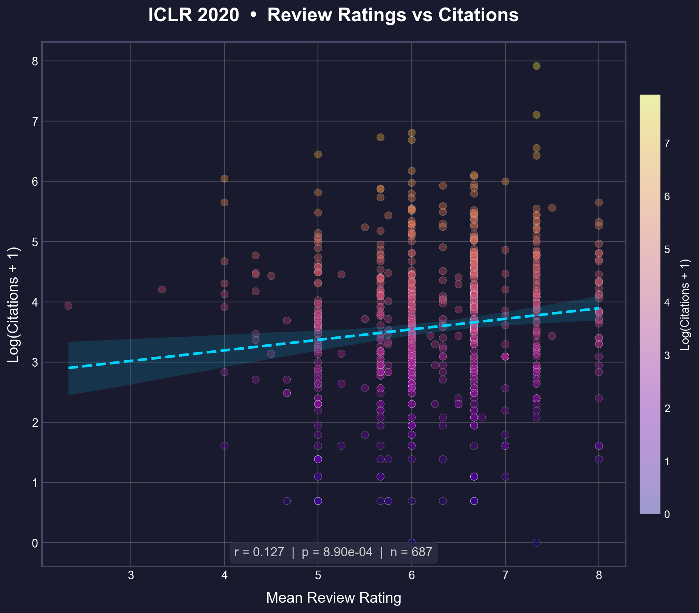
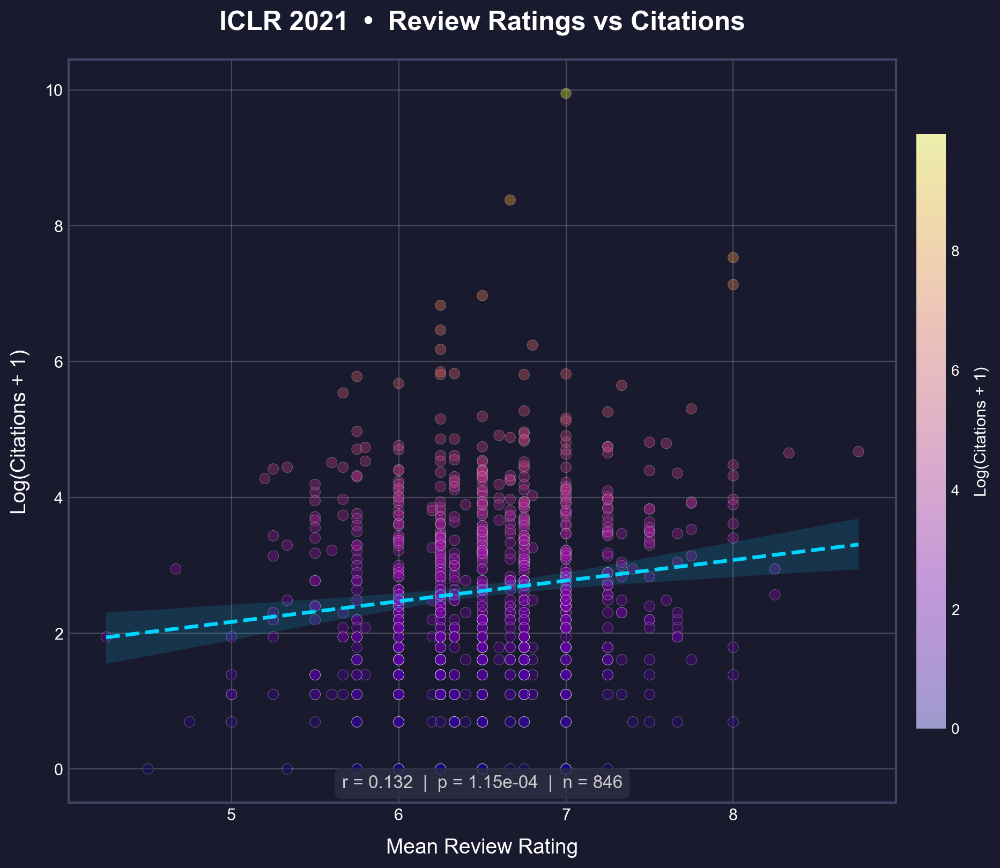
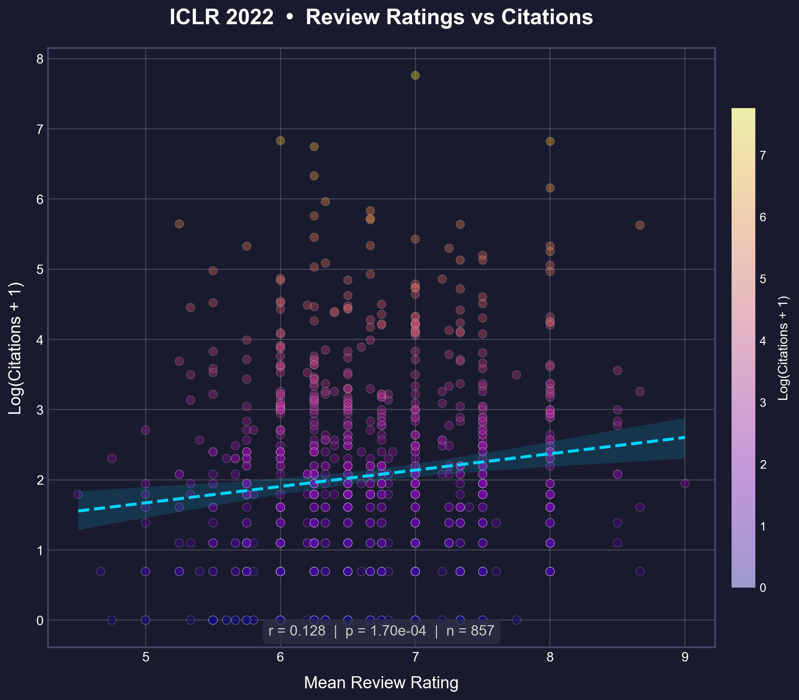

# OpenReview Ratings vs Citations

> **Do peer review scores predict scientific impact?**  
> An empirical analysis of ICLR papers (2017–2023)


📺 **[PyCon Korea 2022 talk (Korean)](https://www.youtube.com/watch?v=MqM2ROgWwhU)**

---

## Overview

This project explores the question: **"Can reviewers recognize the 'sprouts' of seminal research?"**

This analysis investigates whether peer review scores on OpenReview effectively predict the future impact (citation count) of papers. With the rapid growth of the ML field, the hypothesis is that the predictive power of reviews may be declining due to reviewer fatigue and the influx of less experienced reviewers with the explosion of paper submissions.

---

## Key Finding

**The correlation between review ratings and citations has been declining over time:**

| Year | Papers | Pearson (r) |
|------|--------|-------------|
| 2017 | 245 | 0.37 |
| 2018 | 425 | 0.29 |
| 2019 | 502 | 0.17 |
| 2020 | 687 | 0.12 |
| 2021 | 865 | 0.13 |
| 2022 | 1094 | 0.13 |

<table>
  <tr>
    <td></td>
    <td></td>
  </tr>
  <tr>
    <td></td>
    <td></td>
  </tr>
  <tr>
    <td></td>
    <td></td>
  </tr>
</table>

### Methodology

- **Pearson**: Measures linear relationship between mean rating and log(citations + 1). Assumes roughly normal distributions.
- **Data Source**: 
    - **Citations**: [OpenAlex](https://openalex.org/) (Migrated from Google Scholar to improve reliability and scale).
    - **Ratings**: [OpenReview](https://openreview.net/).


**The declining trend is robust.**

**Why log(citations + 1)?**

Citation counts follow a heavy-tailed distribution ([Redner, 1998](https://doi.org/10.1007/s100510050276); [Radicchi et al., 2008](https://doi.org/10.1073/pnas.0806977105)). Log transformation reduces outlier dominance and reflects scale-level differences (10→100 is more meaningful than 10,000→10,090).

Log transformation reduces outlier dominance and reflects scale-level differences (10→100 is more meaningful than 10,000→10,090).

### [New!] Confidence Analysis

**Do experts predict impact best?**
Surprisingly, no. Our [Deep Dive Analysis](Confidence_Analysis.md) reveals that **Low Confidence** reviewers (outsiders/generalists) were actually the *strongest* predictors of future citation impact ($r=0.16$), while "Experts" had a negative correlation.
> *Takeaway: A "Strong Accept" from a generalist may signal broader appeal than one from a domain expert.*


## Possible Explanations (and Their Limitations)

### Hypothesis 1: Reviewer Quality Degradation
> *As ICLR grew, more reviewers were needed, potentially reducing review quality.*

**Supporting Evidence:**
- **Inexperience**: A 2020 survey revealed that **47%** of reviewers had not published a single paper in the field they were reviewing.
- **Reviewer Fatigue**: The number of submissions has grown exponentially (500 in 2017 → 2,500+ in 2020), while the pool of qualified (Ph.D. level) reviewers has not kept pace. This forces the inclusion of less experienced reviewers and increases workload, potentially lowering review quality.

### Hypothesis 2: Citation Lag (Debunked?)
> *Recent papers haven't accumulated enough citations yet.*

**Counter-Evidence (Indirect Verification):**
- We compared the correlation for **2017 papers** using citations collected in **2018** (early) versus citations collected in **2022** (mature).
- **Result**: The correlation coefficients were nearly identical.
- **Conclusion**: If "citation lag" were the main factor, the correlation for 2017 papers should have been much lower in 2018 than in 2022. The fact that it was stable suggests that the *initialsignal* (or lack thereof) appears early, and simply waiting longer does not necessarily restore the correlation.


---

## Quick Start

```bash
pip install -r requirements.txt
```

### Scrape & Analyze

```bash
# 1. Fetch OpenReview data
python scripts/scrape_openreview.py --year 2024

# 2. Get OpenAlex citations
python scripts/scrape_citations_openalex.py --input data/ICLR2024/preprocessed.parquet --email your_email@example.com

# 3. Generate correlation plot
python scripts/analyze.py --year 2024
```

**Options:**
- `--min-rating 6.0` — Exclude papers below 6 (filter desk rejects influenced by Program Chairs)
- `--output figs/custom/` — Custom output directory

---

## Project Structure

```
├── scripts/
│   ├── scrape_openreview.py          # Fetch data from OpenReview
│   ├── scrape_citations_openalex.py  # Fetch OpenAlex citations
│   ├── scrape_citations.py           # Fetch Google Scholar citations (Deprecated)
│   └── analyze.py                    # Run correlation analysis
├── data/ICLR20**/
│   ├── preprocessed.parquet    # Processed paper data
│   └── openalex_*.json         # Citation data
└── figs/                       # Generated plots
```

---

## References

- [OpenReview Explorer](https://horace.io/OpenReviewExplorer/) — Interactive visualization
- [An Open Review of OpenReview](https://openreview.net/forum?id=Cn706AbJaKW) — Critical analysis of ML peer review
- [Dynamic Patterns of Open Review Process](https://www.sciencedirect.com/science/article/abs/pii/S0378437121005185) — Dynamics of review systems

---

<p align="center">
  <i>Questions or ideas? Open an issue!</i>
</p>
